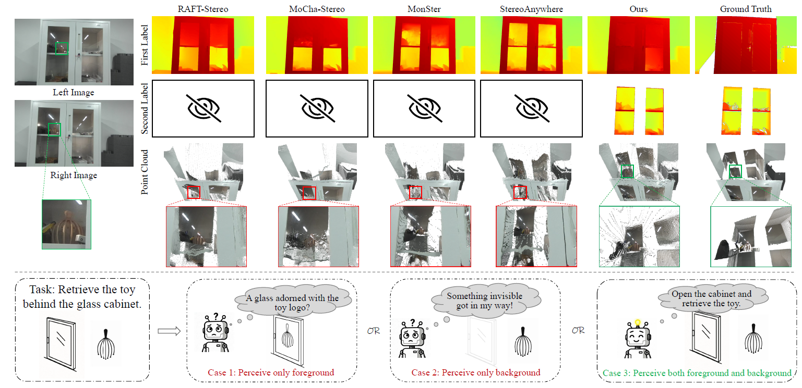

# Multi-label Stereo Matching for Transparent Scene Depth Estimation



## News

- **2025.5.21**: The code will be uploaded in a few weeks.


## Installation

Our code is based on CUDA 11.7 and PyTorch 2.0.1. We recommend using Anaconda to create a new environment:

```bash
conda create -n trans python=3.7
conda activate trans
```

Then, install the dependencies:

```bash
pip install -r requirements.txt
```

## Dataset

We use the [TartanAir](https://github.com/castacks/tartanair_tools), [SceneFlow](https://lmb.informatik.uni-freiburg.de/resources/datasets/SceneFlowDatasets.en.html), and [Raw data of KITTI](https://github.com/youmi-zym/TemporalStereo?tab=readme-ov-file#kitti-20122015) datasets in our experiments. Please download the datasets and organize them as follows:

```
├── datasets
    ├── sceneflow
        ├── driving                                               
        │   ├── disparity                                         
        │   ├── frames_cleanpass                                  
        │   └── frames_finalpass                                  
        ├── flying3d                                              
        │   ├── disparity                                         
        │   ├── frames_cleanpass                                  
        │   └── frames_finalpass                                  
        └── monkaa                                                
            ├── disparity                                         
            ├── frames_cleanpass                                             
            └── frames_finalpass
    ├── TranScene
        ├── left
        │   ├── foreground
        │   ├── background
        │   ├── mask 
        │   └── img
        └── right
```
Our TranScene dataset can be downloaded from <a href="https://drive.google.com/drive/folders/127w9Fmpdvc9yagWNAiuCazYmec4NXrEC/view?usp=sharing">Google Drive</a>.

## Checkpoints

To Do.

## Evaluation

Before evaluation, please download the checkpoints and put them in the `./checkpoints` directory.

You can evaluate the pre-trained models on TranScene by running the following scripts:

```bash
bash trans_evaluate.sh
```

## Training

For SceneFlow dataset, you can train the model by running the following script:
```bash
bash sceneflow_train.sh
```

For TranScene dataset, you can train the model by running the following script:
```bash
bash trans_train.sh
```

## Acknowledgement

Our code is based on [RAFT-Stereo](https://github.com/princeton-vl/RAFT-Stereo). We thank the authors for this great work.
